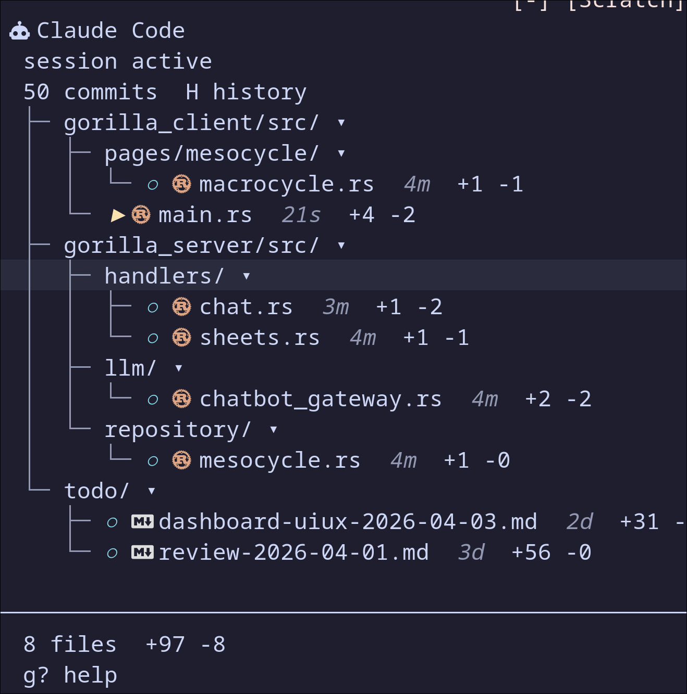
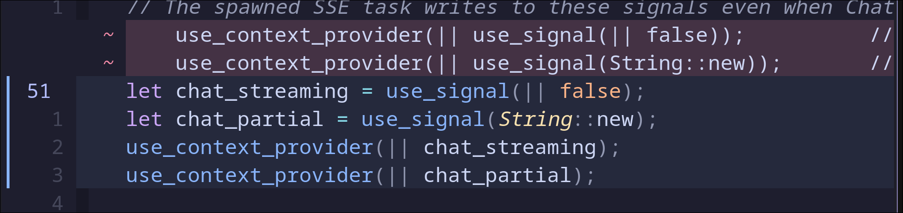
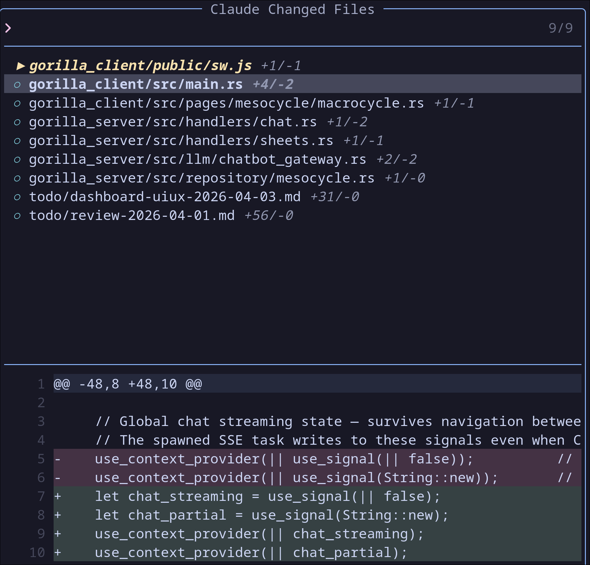
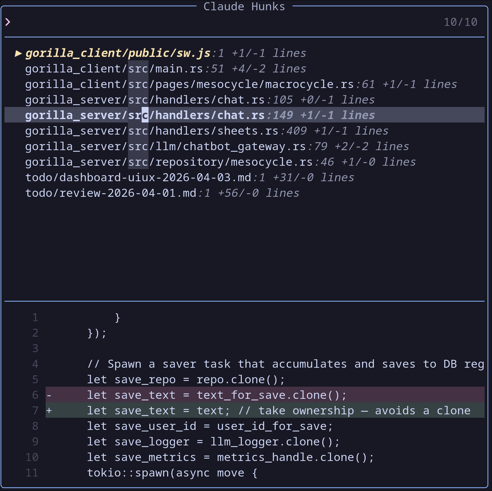
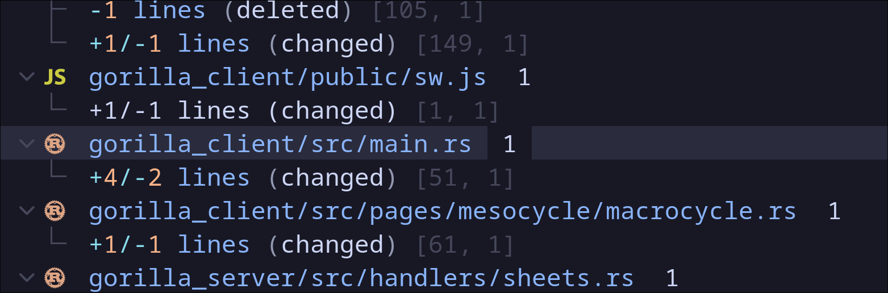
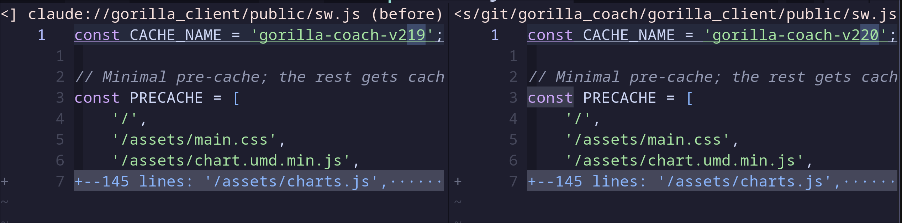
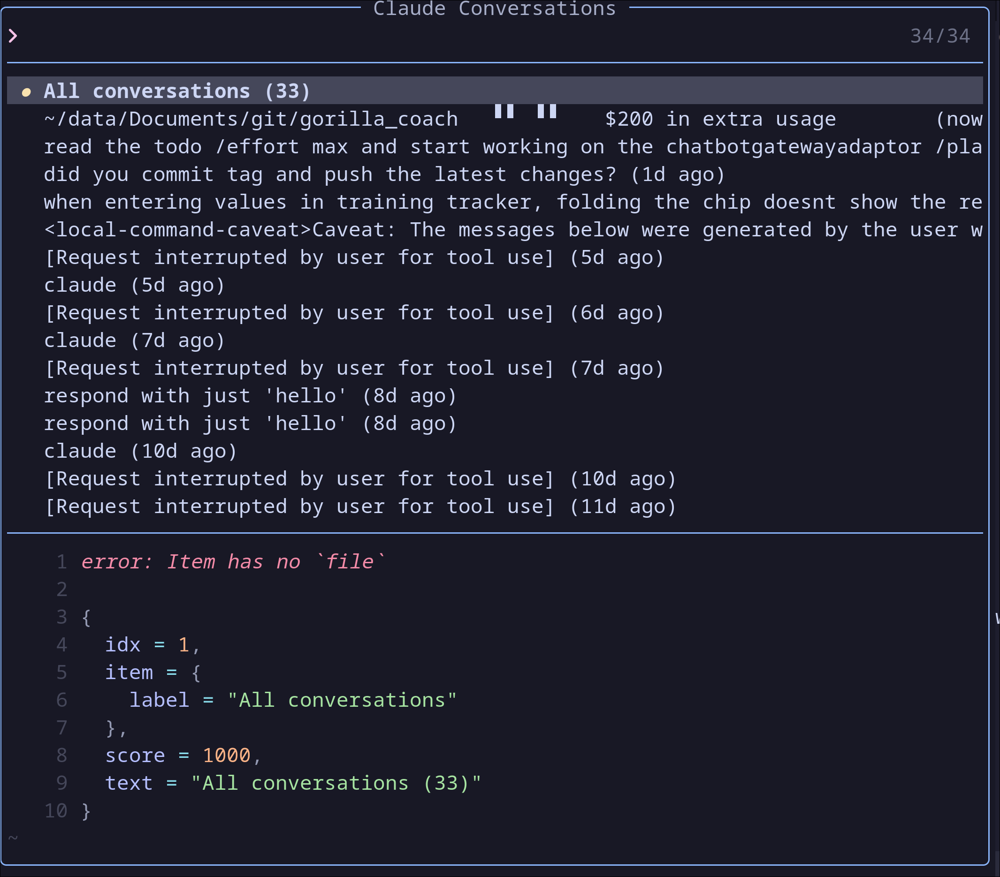

# cc-watcher.nvim

Neovim plugin that monitors [Claude Code](https://claude.ai/claude-code) changes in real time. See what Claude is editing in a sidebar, view inline diffs, and navigate between hunks — all without leaving your editor.

Designed for a **tmux split workflow**: Claude Code on the left, Neovim on the right.

## Features

- **Sidebar** — tree-style file list with directory grouping, modification times, +N/-M stats, updated live
- **Inline diff** — colored highlights showing exactly what changed (no split windows)
- **Sign column indicators** — green/yellow/red bars on changed lines
- **Hunk navigation** — `]c` / `[c` to jump between changes, `cr` to revert a hunk
- **Commit history** — browse past commits where Claude edited files, view commit diffs in the sidebar
- **Session awareness** — reads all JSONL files for a project (multi-session) to find edited files
- **File watchers** — instant detection via libuv `fs_event` (zero CPU when idle)
- **Git HEAD comparison** — compares against git HEAD for accurate diffs, with snapshot fallback for untracked files
- **Batched notifications** — debounced to avoid spam when Claude edits many files
- **Lazy loading** — full lazy.nvim support with command/key/event triggers
- **Pure Lua** — no external dependencies
- **Integrations** (opt-in):
  - [Snacks picker](#snacks-picker) — fuzzy find changed files and hunks with colored diff preview (for [LazyVim](https://www.lazyvim.org/) / snacks.nvim users)
  - [trouble.nvim](#troublenvim) — diagnostic-like list of all changes
  - [Diffview](#diffview) — side-by-side snapshot diff in a tab

## Screenshots

### Sidebar

Tree-style file list with directory grouping, collapsible folders, modification times, and +N/-M diff stats.



### Inline Diff

Colored inline highlights showing exactly what Claude changed — added, modified, and deleted lines.



### Snacks Picker — Changed Files

Fuzzy-find changed files with colored diff preview.



### Snacks Picker — Hunks

Browse individual hunks across all changed files.



### trouble.nvim

Diagnostic-like list of all Claude changes.



### Diffview

Side-by-side diff comparing pre-Claude snapshot (left) with current file (right).



### Session Picker

Switch between Claude Code conversations for the current project.



## How it works

```
┌─ Sidebar ──────────┐┌─ Editor ─────────────────────────────┐
│  󰚩 Claude Code     ││                                       │
│  session active    ││   fn process(data: &str) -> Result {  │
│────────────────────││ ~   old line that was here            │  ← dim red
│  ● src/api.rs +3-1 ││     let result = parse(data)?;        │  ← yellow (changed)
│  ● src/handlers.rs ││ +   let new_field = validate(&data);  │  ← green (added)
│  ○ models.rs       ││     Ok(result)                        │
│────────────────────││   }                                   │
│  3 files  +8 -3    ││                                       │
│  g? help           ││                                       │
└────────────────────┘└───────────────────────────────────────┘

● = live change (detected by file watcher)
○ = session change (from Claude Code's JSONL log)
```

**Colors:**
- **Green background** (`┃` sign) — lines Claude added
- **Yellow background** (`┃` sign) — lines Claude changed (old version shown above in dim red)
- **Red virtual text** (`▁` sign) — lines Claude deleted

## Installation

### [lazy.nvim](https://github.com/folke/lazy.nvim) (recommended)

```lua
{
    "elmomk/cc-watcher.nvim",
    event = { "BufReadPost", "BufNewFile" },
    cmd = {
        "ClaudeSidebar", "ClaudeDiff",
        "ClaudeSnacks", "ClaudeTrouble", "ClaudeDiffview",
    },
    keys = {
        { "<leader>cs", desc = "Claude - toggle sidebar" },
        { "<leader>cd", desc = "Claude - toggle inline diff" },
    },
    opts = {},
}
```

With snacks picker + all integrations (for LazyVim users):

```lua
{
    "elmomk/cc-watcher.nvim",
    event = { "BufReadPost", "BufNewFile" },
    cmd = {
        "ClaudeSidebar", "ClaudeDiff",
        "ClaudeSnacks", "ClaudeTrouble", "ClaudeDiffview",
    },
    keys = {
        { "<leader>cs", desc = "Claude - toggle sidebar" },
        { "<leader>cd", desc = "Claude - toggle inline diff" },
        { "<leader>ct", "<cmd>ClaudeSnacks<cr>", desc = "Claude - changed files" },
        { "<leader>ch", "<cmd>ClaudeSnacks hunks<cr>", desc = "Claude - hunks" },
        { "<leader>cx", "<cmd>ClaudeTrouble<cr>", desc = "Claude - trouble" },
        { "<leader>cv", "<cmd>ClaudeDiffview<cr>", desc = "Claude - diffview" },
    },
    opts = {
        integrations = {
            snacks = true,
            trouble = true,
            diffview = true,
        },
    },
}
```

### Minimal

```lua
{
    "elmomk/cc-watcher.nvim",
    opts = {},
}
```

### Local development

```lua
{
    dir = "~/path/to/cc-watcher.nvim",
    name = "cc-watcher.nvim",
    opts = {},
}
```

## Configuration

All options with their defaults:

```lua
require("cc-watcher").setup({
    -- Sidebar width in columns (use a fraction like 0.6 for 60% of editor width)
    sidebar_width = 100,

    -- Keymaps (set to false to disable any binding)
    keys = {
        toggle_sidebar = "<leader>cs",
        toggle_diff = "<leader>cd",
        snacks_files = "<leader>ct",
        snacks_hunks = "<leader>ch",
        trouble = "<leader>cx",
        diffview = "<leader>cv",
        flash = "<leader>cf",
    },

    -- Opt-in integrations (require the corresponding plugin to be installed)
    integrations = {
        -- Pickers & viewers
        snacks = false,      -- :ClaudeSnacks — fuzzy file/hunk picker (snacks.nvim)
        fzf_lua = false,     -- :ClaudeFzf — fzf-lua picker
        trouble = false,     -- :ClaudeTrouble — diagnostic-like list (trouble.nvim)
        diffview = false,    -- :ClaudeDiffview — side-by-side diff tab

        -- Auto-actions on Claude edits
        conform = false,     -- auto-format after Claude edits (conform.nvim)
        neotest = false,     -- auto-run tests when test files change (neotest)
        overseer = false,    -- fire ClaudeFileChanged event for tasks (overseer.nvim)

        -- UI enhancements
        gitsigns = false,    -- refresh gitsigns after Claude edits (gitsigns.nvim)
        neotree = false,     -- mark changed files in neo-tree (neo-tree.nvim)
        edgy = false,        -- dock sidebar with edgy.nvim
        fidget = false,      -- show activity spinner (fidget.nvim)
        notifier = false,    -- rich notifications (snacks.nvim notifier)

        -- Alternative navigation & diff
        flash = false,       -- :ClaudeFlash — jump to hunks with labels (flash.nvim)
        mini_diff = false,   -- use mini.diff with Claude baseline (mini.diff)
    },
})
```

## Keybindings

### Global

| Key | Action |
|-----|--------|
| `<leader>cs` | Toggle sidebar |
| `<leader>cd` | Toggle inline diff for current file |
| `<leader>ct` | Snacks changed files picker |
| `<leader>ch` | Snacks hunks picker |
| `<leader>cx` | Open trouble.nvim with Claude changes |
| `<leader>cv` | Open diffview |
| `<leader>cf` | Flash jump to hunks |

### Sidebar

| Key | Action |
|-----|--------|
| `<CR>` / `d` | Open file with inline diff |
| `o` | Open file with diff |
| `H` | Toggle commit history mode |
| `]g` | Next commit (in history mode) |
| `[g` | Previous commit (in history mode) |
| `r` | Refresh file list |
| `q` | Close sidebar |
| `g?` | Show help popup |

### When diff is active

| Key | Action |
|-----|--------|
| `]c` | Jump to next hunk |
| `[c` | Jump to previous hunk |
| `cr` | Revert hunk under cursor |
| `<leader>cd` | Toggle diff off |

### Diffview (`:ClaudeDiffview`)

| Key | Action |
|-----|--------|
| `]f` | Next file |
| `[f` | Previous file |
| `q` | Close diff tab |

## Commands

| Command | Description |
|---------|-------------|
| `:ClaudeSidebar` | Toggle the changed files sidebar |
| `:ClaudeDiff` | Toggle inline diff for current file |
| `:ClaudeSnacks [changed_files\|hunks]` | Snacks picker for Claude changes |
| `:ClaudeFzf [changed_files\|hunks]` | fzf-lua picker for Claude changes |
| `:ClaudeTrouble` | Open trouble.nvim with Claude changes |
| `:ClaudeDiffview [file]` | Side-by-side diff view |
| `:ClaudeFlash` | Jump to hunks with flash.nvim labels |

## Integrations

All integrations are **opt-in** — enable them in your config and install the corresponding plugin.

### Snacks picker

```lua
opts = { integrations = { snacks = true } }
```

- `:ClaudeSnacks` — **changed files picker** with colored diff preview (green/red highlights)
- `:ClaudeSnacks hunks` — **hunk picker** with file preview at hunk location
- `<CR>` opens file with inline diff and jumps to first change

Requires: [snacks.nvim](https://github.com/folke/snacks.nvim) (included by default in LazyVim)

### trouble.nvim

```lua
opts = { integrations = { trouble = true } }
```

- `:ClaudeTrouble` — diagnostic-like list of all Claude changes
- Each hunk appears as: info (additions), warning (modifications), hint (deletions)

Requires: [trouble.nvim](https://github.com/folke/trouble.nvim) v3

### Diffview

```lua
opts = { integrations = { diffview = true } }
```

- `:ClaudeDiffview` — side-by-side diff for all changed files in a new tab
- `:ClaudeDiffview path/to/file` — diff for a single file
- Left pane: snapshot (pre-Claude state, readonly), right pane: current file
- Navigate between files with `]f`/`[f`, close with `q`

Uses vim's built-in diff mode — no additional plugin required.

### conform.nvim (auto-format)

```lua
opts = { integrations = { conform = true } }
```

Automatically formats files after Claude edits them using [conform.nvim](https://github.com/stevearc/conform.nvim). Runs async and silent.

### neotest (auto-test)

```lua
opts = { integrations = { neotest = true } }
```

Automatically runs tests when Claude edits test files (detects `_test.`, `_spec.`, `.test.`, `.spec.`, `test_`, `/tests/`, etc.). Requires [neotest](https://github.com/nvim-neotest/neotest).

### gitsigns.nvim

```lua
opts = { integrations = { gitsigns = true } }
```

Refreshes [gitsigns](https://github.com/lewis6991/gitsigns.nvim) after Claude edits files so git diff signs stay accurate.

### neo-tree.nvim

```lua
opts = { integrations = { neotree = true } }
```

Refreshes [neo-tree](https://github.com/nvim-neo-tree/neo-tree.nvim) git status when Claude changes files. Also exposes a component for showing Claude indicators in the tree.

### edgy.nvim

```lua
opts = { integrations = { edgy = true } }
```

Docks the Claude sidebar with [edgy.nvim](https://github.com/folke/edgy.nvim). Add to your edgy config:

```lua
left = {
    require("cc-watcher.integrations.edgy").panel,
}
```

### fidget.nvim

```lua
opts = { integrations = { fidget = true } }
```

Shows a progress spinner via [fidget.nvim](https://github.com/j-hui/fidget.nvim) when Claude is actively editing files. Auto-clears after 3 seconds of inactivity.

### overseer.nvim

```lua
opts = { integrations = { overseer = true } }
```

Fires a `User ClaudeFileChanged` event on every Claude edit, which [overseer.nvim](https://github.com/stevearc/overseer.nvim) templates can listen to. Also provides `require("cc-watcher.integrations.overseer").run_on_change("task_name")`.

### snacks.nvim notifier

```lua
opts = { integrations = { notifier = true } }
```

Replaces plain `vim.notify` with rich [snacks.nvim](https://github.com/folke/snacks.nvim) notifications showing changed file details.

### flash.nvim

```lua
opts = { integrations = { flash = true } }
```

- `:ClaudeFlash` — jump to any hunk in the current file using [flash.nvim](https://github.com/folke/flash.nvim) labels

### mini.diff

```lua
opts = { integrations = { mini_diff = true } }
```

Registers Claude's "before" content as a [mini.diff](https://github.com/echasnovski/mini.diff) reference source. Auto-attaches to buffers Claude has changed.

## LazyVim Dashboard Setup

If you use [LazyVim](https://www.lazyvim.org/) with the snacks.nvim dashboard, you can add a "Claude Changes" entry to your startup page.

Create `~/.config/nvim/lua/plugins/dashboard.lua`:

```lua
return {
  "snacks.nvim",
  opts = {
    dashboard = {
      preset = {
        -- stylua: ignore
        ---@type snacks.dashboard.Item[]
        keys = {
          { icon = " ", key = "f", desc = "Find File", action = ":lua Snacks.dashboard.pick('files')" },
          { icon = " ", key = "n", desc = "New File", action = ":ene | startinsert" },
          { icon = " ", key = "g", desc = "Find Text", action = ":lua Snacks.dashboard.pick('live_grep')" },
          { icon = " ", key = "r", desc = "Recent Files", action = ":lua Snacks.dashboard.pick('oldfiles')" },
          { icon = " ", key = "c", desc = "Config", action = ":lua Snacks.dashboard.pick('files', {cwd = vim.fn.stdpath('config')})" },
          { icon = " ", key = "s", desc = "Restore Session", section = "session" },
          { icon = " ", key = "w", desc = "Claude Changes", action = ":lua vim.cmd('enew'); vim.bo.bufhidden = 'wipe'; vim.cmd('ClaudeSnacks')" },
          { icon = " ", key = "x", desc = "Lazy Extras", action = ":LazyExtras" },
          { icon = "󰒲 ", key = "l", desc = "Lazy", action = ":Lazy" },
          { icon = " ", key = "q", desc = "Quit", action = ":qa" },
        },
      },
    },
  },
}
```

Pressing `w` on the startup page opens the snacks changed files picker with diff preview, dismissing the dashboard automatically.

### Lualine (LazyVim)

To add the cc-watcher statusline indicator to LazyVim's lualine, create `~/.config/nvim/lua/plugins/lualine.lua`:

```lua
return {
  "nvim-lualine/lualine.nvim",
  opts = function(_, opts)
    table.insert(opts.sections.lualine_x, 1, {
      function()
        return require("cc-watcher").statusline()
      end,
      cond = function()
        local ok, watcher = pcall(require, "cc-watcher.watcher")
        return ok and vim.tbl_count(watcher.get_changed_files()) > 0
      end,
    })
  end,
}
```

This shows `󰚩 N` in the statusline when Claude has changed files.

## Statusline

```lua
-- lualine
sections = {
    lualine_x = {
        {
            require("cc-watcher").statusline,
            cond = function()
                return require("cc-watcher").statusline() ~= ""
            end,
        },
    },
}
```

Returns `""` when no changes, or `"󰚩 N"` where N is the count of changed files.

## How it detects changes

1. **Multi-session JSONL** — reads **all** JSONL files under `~/.claude/projects/*/` for the current project (not just the latest) to find `Write`/`Edit` tool calls Claude made. Files inside `.claude/` are filtered out. Only files inside the project directory with actual uncommitted diffs are shown.

2. **File watchers** — for files you've opened, libuv `fs_event` watchers detect changes instantly and auto-reload the buffer.

3. **Git HEAD comparison** — diffs compare against `git show HEAD:<file>` for accurate results. For untracked files (not in git), snapshots stored in memory (LRU cache, max 100 files) are used as a fallback.

## Requirements

- Neovim >= 0.10
- [Claude Code](https://claude.ai/claude-code) running in the same directory

**Optional (for integrations):**
- [snacks.nvim](https://github.com/folke/snacks.nvim) — picker + notifier (included in LazyVim)
- [fzf-lua](https://github.com/ibhagwan/fzf-lua) — fzf picker
- [trouble.nvim](https://github.com/folke/trouble.nvim) v3 — diagnostic list
- [conform.nvim](https://github.com/stevearc/conform.nvim) — auto-format
- [neotest](https://github.com/nvim-neotest/neotest) — auto-test
- [gitsigns.nvim](https://github.com/lewis6991/gitsigns.nvim) — git sign refresh
- [neo-tree.nvim](https://github.com/nvim-neo-tree/neo-tree.nvim) — file explorer markers
- [edgy.nvim](https://github.com/folke/edgy.nvim) — sidebar docking
- [fidget.nvim](https://github.com/j-hui/fidget.nvim) — activity spinner
- [overseer.nvim](https://github.com/stevearc/overseer.nvim) — task runner
- [flash.nvim](https://github.com/folke/flash.nvim) — hunk jump labels
- [mini.diff](https://github.com/echasnovski/mini.diff) — alternative diff
- [nvim-web-devicons](https://github.com/nvim-tree/nvim-web-devicons) — file icons in sidebar/pickers

## Documentation

- `:help cc-watcher` — full vimdoc reference
- [`doc/tutorial.md`](doc/tutorial.md) — in-depth hands-on tutorial
- [`doc/lua-plugin-guide.md`](doc/lua-plugin-guide.md) — Lua plugin development guide

## Highlight groups

All highlights use `default = true` so you can override them in your colorscheme:

| Group | Default | Used for |
|-------|---------|----------|
| `ClaudeDiffAdd` | green bg | Added lines |
| `ClaudeDiffChange` | yellow bg | Changed lines |
| `ClaudeDiffDelete` | red bg, dim text | Deleted lines (virtual text) |
| `ClaudeDiffAddSign` | green | Sign column: added |
| `ClaudeDiffChangeSign` | yellow | Sign column: changed |
| `ClaudeDiffDeleteSign` | red | Sign column: deleted |
| `ClaudeHeader` | mauve, bold | Sidebar title |
| `ClaudeActive` | green | Session active indicator |
| `ClaudeInactive` | grey, italic | No session indicator |
| `ClaudeLive` | yellow | Live-detected file (●) |
| `ClaudeSession` | blue | Session-detected file (○) |
| `ClaudeFile` | white | Filenames |
| `ClaudeFileCurrent` | white, bold, bg | Currently open file in sidebar |
| `ClaudeFileLatest` | italic, DiagnosticWarn fg | Most recently edited file in sidebar |
| `ClaudeStats` | dark grey | +N/-M stats |
| `ClaudeCount` | blue | File count summary |
| `ClaudeSep` | dark grey | Separator lines |
| `ClaudeHelp` | dark grey | Help text |

## License

MIT
